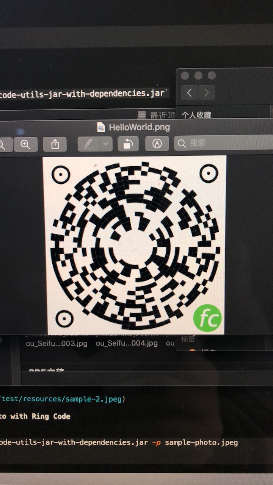
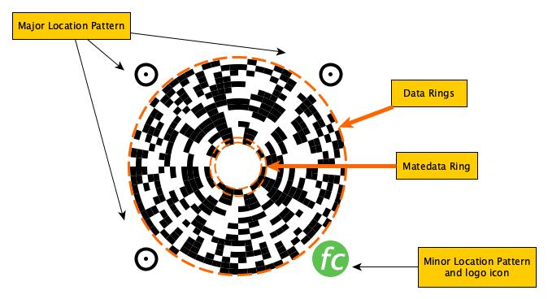
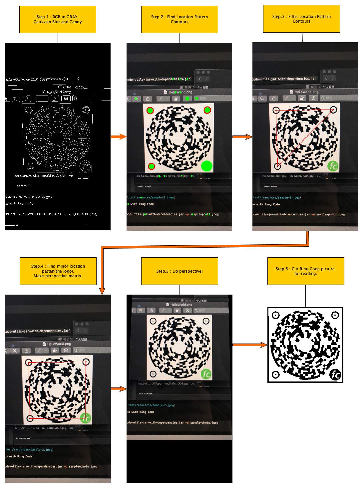

# Floppy Code


Yet another matrix barcode (or two-dimensional barcode).

## How to generate Ring Code picture

### Build java code

```bash
$ cd project-directory
$ ./build.sh
```

### Use Ring Code Utils

jar file path: `target/ring-code-utils-jar-with-dependencies.jar`

```bash
$ java -jar target/ring-code-utils-jar-with-dependencies.jar
```

```
usage: java -jar ring-code-utils.jar [OPTION] <FILENAME>
 -c         🌈 Colored ring code picture. Require with -g.
 -f <arg>   📄 Ring code picture format. Require with -g.
 -g <arg>   🏞 Generate ring code picture.
 -help      😳 Help information.
 -p         📷 Read ring code in photo.
 -r         📤 Read the raw ring code picture.
 -test      🛠 Debug mode.
```

Generate a Ring Code picture: Using `png` picture file format, with message `你好，世界！` and output file is `HelloWorld.png`

```bash
$ java -jar target/ring-code-utils-jar-with-dependencies.jar -g "你好，世界！" -fpng HelloWorld.png
```
Generated picture should like this:


## How to get message from Ring Code picture

### Take a photo contains Ring Code picture

Named `sample-photo.jpeg`



### Read message from Ring Code photo 

```bash
$ java -jar target/ring-code-utils-jar-with-dependencies.jar -p sample-photo.jpeg
你好，世界！
$ 
```

## Implement

### Ring Code Structure



### How to get message from Ring Code photo


